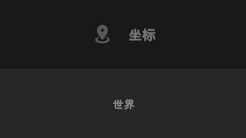
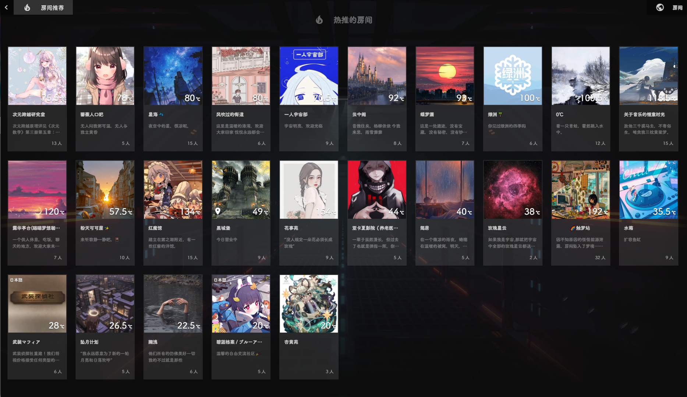
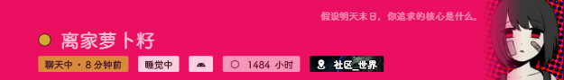

# 个人热度贡献详解

> 作者：幽萝Yuro
> 编辑于 2023年01月08日 23:42

## 简介

你可能注意到，不论是查看房间用户还是私聊消息，每个人的旁边都有一个小小的色块标识。这其中就包含了很多奥秘哦，这次就围绕小小的色块开始讲起吧~

辛辛苦苦抠出来的

图中的一个个小色块就是用于标识用户状态的状态标识啦，除了图中的12种颜色外还有一个例外，那就是BOT账户专属的蓝色标识。

上线后只拥有蓝色状态标识的BOT账户

通过观察色块的颜色深浅就可以大致判断对方的状态，这是晋升蔷薇老用户的必学技能！

:::tip 小细节
蔷薇的方形状态标识为16*16像素，每隔两分钟统一更新一次颜色。
:::

## 用户状态分布

打开左侧边栏，找到 **工具 -> 终端**，然后在终端中输入 `stats`，可以看到当前不同活跃状态下的用户分布数据。

某时刻IIROSE终端输入stats后的反馈

| 状态                  | 人数 | 标识颜色 | 描述         |
| :-------------------- | :--- | :------- | :----------- |
| **Online (总在线)**   | 292  | -        | -            |
| **BOT (人工智能)**    | 30   | 蓝色     | BOT账户      |
| **Chatting (聊天中)** | 46   | 绿色     | 正在聊天     |
| **Active (窥屏中)**   | 52   | 橙色     | 在线但未发言 |
| **Away (挂机中)**     | 159  | 红色     | 长时间未活动 |
| **Entering (刚进房)** | 5    | 灰色     | 刚进入房间   |

由此我们可以知道，看到对方为绿色标识时，对方大概率在聊天；看到对方为橙色标识时，对方应该在忙着别的事情，@一下也许能回应；而看到对方是红色标识时，八成没时间摸鱼或者在睡觉。

## 状态颜色详解

如果你是资深老用户，就可以通过辨别颜色来精准知晓对方离开了几分钟，这可是资深老用户才会的技能哦！

### 绿色阶段 (聊天中)

#### 蛙绿 (0-2分钟)

距上次发言0~2min

首先是刚发言后的 **蛙绿** ，所有标识中最绿的，如果你看到你喜欢的人标识为蛙绿色，马上传送过去贴贴吧!

:::tip 传送方法
查看对方资料，在最下方(相册上，点赞和状态旁)就可以找到坐标栏，点击下方坐标就可以传送到对方所在的房间啦！(前提是不上锁)

坐标示例

:::

#### 草原绿 (2-4分钟)

距上次发言2~4min

其次是微微变暗的 **草原绿** ，代表对方说过话后在2分钟内都没有再发言，可能对方面临了冷场的状况，快速速按照上文魔法飞过去支援！

#### 黄绿色 (4-6分钟)

距上次发言4~6min

之后是有点黄又有点绿的 **黄绿色** 标识，大概是摸鱼时说一句话然后又忙着工作了。

#### 枯草绿 (6-8分钟)

距上次发言6~8min

再之后是呈现出水分不足的小草上的 **枯草绿** ，对方大概是无法摸鱼了。

#### 蛋黄色 (8-10分钟)

距离上次发言8~10min

最后是绿色阶段的最后一种颜色标识， **蛋黄色** ，八成是要挂机了。

### 灰色与橙色阶段 (窥屏中)

#### 镍灰色 (刚进房 0-2分钟)

刚进入房间0~2分钟

此种标识的颜色为 **镍灰色** ，用于表示刚进入房间(Entering)的用户，表示刚进入房间还没立即发言，正在准备接话题的用户。

:::tip
可以注意到在本文章封面图里我把镍灰色和蛋黄色处于同一列，因为在镍灰色持续2分钟后会自动转换为下一个标识色，而这个标识色同淡黄色的下个阶段标识色一致，故将镍灰色置于淡黄色上。
:::

#### 淡橘橙 (窥屏 10-12分钟 / 沉默 2-4分钟)

淡橘橙

**橘橙色** ，在蔷薇颇为常见的颜色，表示对方距离上次发言10~12分钟 / 进入房间沉默2~4分钟。

:::tip 小细节
经过多次测试发现，用户自己重载或刚进入房间时，从自己的视角看自身标识色为橘橙色，而从别的用户眼中则是镍灰色。
:::

#### 杏黄色 (窥屏 12-14分钟 / 沉默 4-6分钟)

杏黄色

**杏黄色** ，表示对方距离上次发言12~14分钟 / 已进入房间沉默4~6分钟。

#### 脐橙色 (窥屏 14-16分钟 / 沉默 6-8分钟)

脐橙色

**脐橙色** ，表示对方距离上次发言14~16分钟 / 已进入房间沉默6~8分钟。

#### 蟹壳红 (窥屏 16-18分钟 / 沉默 8-10分钟)

蟹壳红

**蟹壳红** ，就是橙红色，表示对方距离上次发言16~18分钟 / 已进入房间沉默8~10分钟。

#### 桂红 (窥屏 18-20分钟 / 沉默 10-12分钟)

桂红

**桂红** ，就是夕阳色，表示对方距离上次发言18~20分钟 / 已进入房间沉默10~12分钟。

### 红色阶段 (挂机中)

#### 淡菽红 (20分钟以上)

淡菽红

**淡菽红** ，也是蔷薇标识色里最红的颜色，表示对方距离上次发言20+分钟 / 已进入房间沉默12+分钟。说人话就是，凉了，真去挂机了，@好几下也不一定能回来。

## 房间热度机制

知道了这些内容还没完，蔷薇标识色还和房间热度有所关联，咱们继续吧。

### 房间分布

蔷薇内部有四大分房间分区，在如此多的房间中，如何寻找热闹的房间呢？

| 分区     | 房间数 (表层+嵌套) | 备注                   |
| :------- | :----------------- | :--------------------- |
| **社区** | 6+16=22            | 现已移除部分房间       |
| **住宅** | 106+38=144         | -                      |
| **旅馆** | 26+1=27            | -                      |
| **沙盒** | 84+42=126          | -                      |
| **总计** | 319                | (2022.12.10日中午统计) |

在想要聚集起大家聊天，供用户挑选热闹的房间的需求下，房间热推机制应就运而生。

:::tip 房间热度说明
除 **上锁房间** 及 **其子房间** 和部分 **特殊系统房间** 外，非BOT账户 包括受限账户及游客都可在房间内发言来为房间提供热度，且在热度提供上均无差异（非游客用户可亦可通过弹幕产生热度）。
:::

:::tip 聊天收益
区分该房间是否有聊天收益的方法是，在房间中发言并在热推房间中查看该房间是否上榜，在因各种原因限制无法上榜的房间内聊天无聊天收益（除冷冻仓外依旧有挂机收益和房主收益）。
:::

### 状态与热度贡献

状态标识的颜色会每隔2分钟更新一次，具体到秒则不按照该用户进入房间的时间和发言的时间，而是全蔷薇用户在同一分钟同一秒下完成状态标识颜色的更新。通过不断实验观察，可将状态标识的颜色和具体热度值对应。

热度表

| 颜色   | 状态   | 距上次发言/沉默时间   | 热度贡献 |
| :----- | :----- | :-------------------- | :------- |
| 蛙绿   | 聊天中 | 0-2 min               | 20       |
| 草原绿 | 聊天中 | 2-4 min               | 18       |
| 黄绿色 | 聊天中 | 4-6 min               | 16       |
| 枯草绿 | 聊天中 | 6-8 min               | 14       |
| 蛋黄色 | 聊天中 | 8-10 min              | 12       |
| 镍灰色 | 刚进房 | 0-2 min               | 1        |
| 淡橘橙 | 窥屏中 | 10-12 min / 2-4 min   | 4        |
| 杏黄色 | 窥屏中 | 12-14 min / 4-6 min   | 3.5      |
| 脐橙色 | 窥屏中 | 14-16 min / 6-8 min   | 3        |
| 蟹壳红 | 窥屏中 | 16-18 min / 8-10 min  | 2.5      |
| 桂红   | 窥屏中 | 18-20 min / 10-12 min | 2        |
| 淡菽红 | 挂机中 | 20+ min / 12+ min     | 0        |

- 由绿色阶段转为橙色阶段，也就是距上次发言10分钟后，个人热度由12度骤降至4度。
- 由灰色阶段转为橙色阶段，也就是进入房间沉默2分钟后，个人热度从1度跳至4度。
- 红色阶段的挂机用户则同BOT账户一样不为房间贡献热度。

## 热推房间排序算法

房间在有了用户贡献的热度后，活跃度超过20度的房间将会按一定规则从上至下，从左至右排列在热推房间页面下。

自2022年11月25日更新后，房间热推排序从房间热度由高到低排布作出算法改动，以帮助新弱房间能得到更多关注和萌新流入。

:::tip 算法规则
具体算法参考蔷薇日志Ver 1014 第四条：
**接近平均热度的房间是最高位, 超过平均线以后就会以 `超过的部分/3` 减少热度排序**
:::

2022.12.10下午截图

以上图为例：

- 图中的热推房间共出现热度达到20度及以上的房间25间。
- 总热度为 1869度
- 平均热度为 1869/25 = 74.76度
- 其中排名最靠前的房间热度为 75.5度，最接近平均值。
- 最高热度为 192度的房间却排在后列。

以此刻最高热度的 **触梦站** 为例：
经过算法计算后的热度为 `74.76 - (192 - 74.76) / 3 = 35.68` 度。所以 **触梦站** 会排在38度的 **玫瑰星云** 后，排在35.5度的 **水箱** 前。

### 热度显示细节

:::warning 注意
- **自己重载或者进入新房间后**，在己方视角下自身的状态标识仍为橙色，所贡献的热度为4度。而在其他人的视角下则是灰色标识，所贡献的热度为1度。因此，自己所在的房间的热度可能与别人眼中的不一致。
- **在同一房间内**，自己和他人的状态标识是实时更新。而在不同房间下若不重载手动更新则存在至多2分钟的标识误差。
- **结论就是**，你这边看着别人可能在线，你过去可能就离线了，这个就是误差。
:::

## 补充内容 (2023.1.8)

### 关于隐式传送

根据实验，隐式传送的表现已和早期不同。目前状态为，隐式传送后仍显示为在线状态，且状态和坐标固定不变，随每隔2分钟一次的更新在固定秒数时更新状态和坐标。

也就是说隐式传送取消了短期坐标防追踪保护，在目前只有以在房间中显示下线信息而不显示移动到目标房间信息这一作用。

### 关于更新内容

就在我写完这篇文章没两天，蔷薇就更新了在用户卡片可查询对方详细状态的功能，以后不用再看颜色猜时间了，时间直接给出来了。

Ver 1032 更新内容

分为三个阶段，分别是 **聊天中、活跃中、挂机中**。
- **聊天中**: 从绿色到橙色的阶段。其中刚发言两分钟内不显示沉默时间。
- **活跃中**: 从橙色到红色的阶段。且从头开始显示沉默时间，最小显示为2分钟前，其中淡橘橙色时亦不显示沉默时间。（手机屏幕保持亮屏且在蔷薇界面内则可维持在淡橘橙色，电脑更易达成）
- **挂机中**: 不显示沉默时间。

### 特殊情况案例

可能是有些地方不太完美，在私信列表中显示为淡橘橙色窥屏状态，但是在目录里搜索目标用户那里显示的状态为偏红色，在用户资料卡片显示颜色也亦是如此。只是显示的文字提示是无沉默时间的活跃中，文字提示与真实状态匹配，而部分地方的状态颜色与真实状态颜色不一致。

我承认，我这次又花精力研究细枝末节的东西了唔，根本没什么用途嘛。

这就是我的癖好，哪怕没人看。

希望你能早点睡觉，不要想有的没的。

拜拜~
