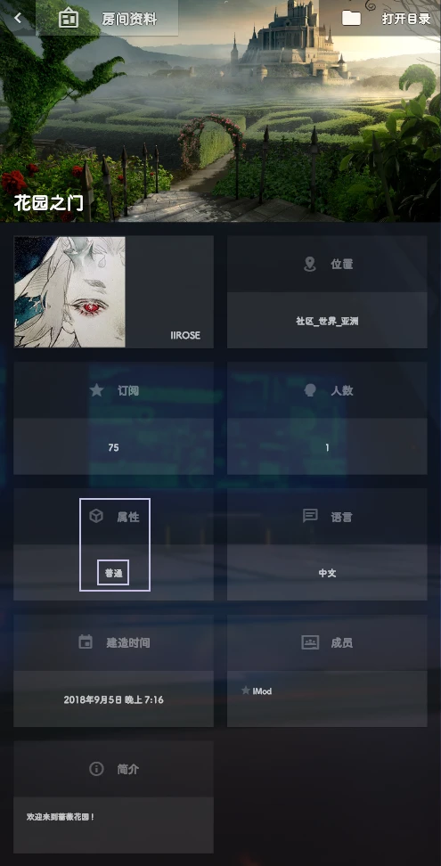
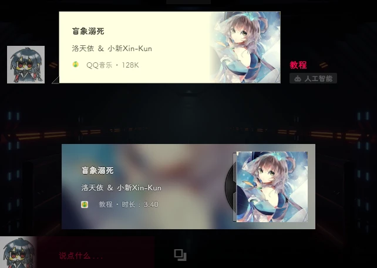
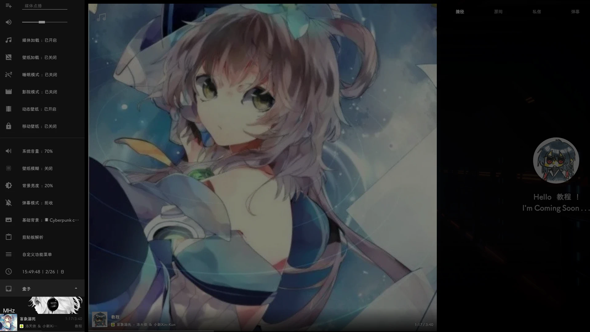
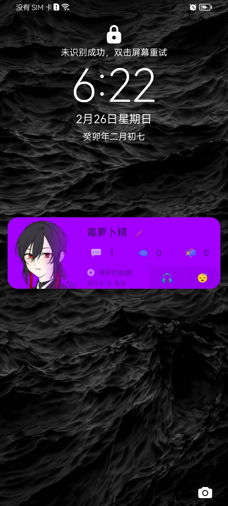
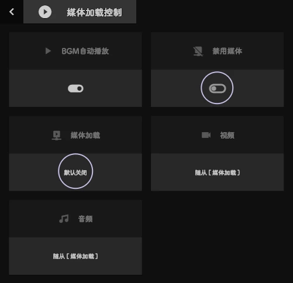
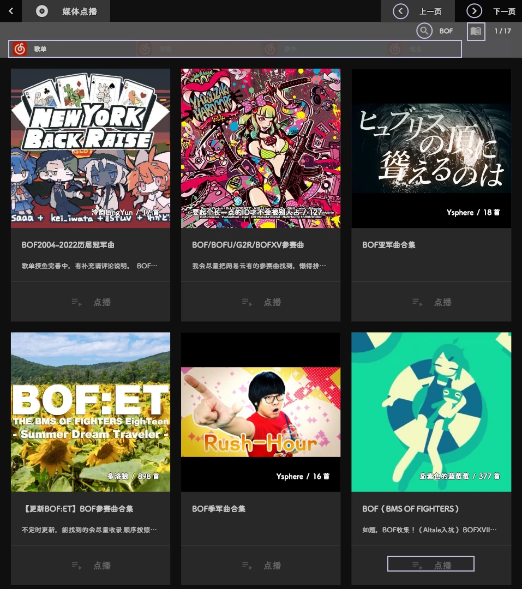
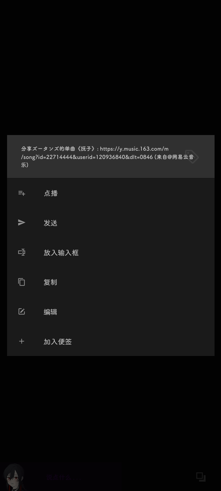
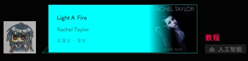

# 蔷薇花园IIROSE：音频点播详解

> 作者：幽萝Yuro  
> 编辑于 2023年03月04日 13:09

蔷薇花园IIROSE是多功能网络聊天室，除了打字发图发语音外还具有其他功能。本篇文章就来介绍花园内的媒体点播功能🎶

如果你是新来的用户，你一定会有以下疑问：
- 怎么会突然响起音乐？
- 我该如何播放音乐？
- 我该如何关闭音乐？

别急，我会由浅入深教会你我所知道的全部。

## 初级篇

### 如何点播音乐

如果你想点播平台音乐，你可以在聊天框输入：`@` + `关键词/链接`

关键词可以是部分歌名或作者名，发送后即可进入选歌界面。

:::tip
此操作不会艾特用户，艾特功能另有格式。
:::

  

在输入框填写 @加关键词

### 为什么无法点播媒体

如果你所在房间无法点播媒体，有以下三种情况：

| 原因               | 示例房间       | 截图                                                                                                                                                              |
| :----------------- | :------------- | :---------------------------------------------------------------------------------------------------------------------------------------------------------------- |
| **房间限制发言**   | 社区，空间站   | 

 |
| **房间限制点播**   | IIROSE 工作室  | 

 |
| **房间属性不支持** | 花园之门，桥洞 | 

 |

:::tip
房间属性为 **普通**、**音乐** 或 **视频** 时，不支持媒体点播。你需要移步到房间属性为 **音乐分享** 或 **视频分享** 的房间中尝试。

  

花园之门房间资料

:::

### 选歌与点播

目前蔷薇支持的平台有：**网易云音乐**、**QQ音乐**、**酷狗音乐**。部分歌曲非全平台，可在上方点击切换平台来搜寻歌曲。

如果找到自己想点的歌曲可以点击歌曲封面下的 "**点播**" 按钮进行点播。

:::warning
如果点击歌曲封面会跳转至平台详情页。
:::

  

选歌界面

点播成功后会在房间消息页面显示点播信息，并按照点播时间顺序依次播放。当点播内容开始播放时，会在聊天框上浮现点播卡片。

  

点播成功！

#### 关于付费歌曲

| 平台           | 付费歌曲表现                 |
| :------------- | :--------------------------- |
| **网易云音乐** | 可试听30秒                   |
| **QQ音乐**     | 无法点播及试听               |
| **酷狗音乐**   | 点击点播按钮后会提示无法播放 |

  

付费歌曲示例

### 如何关闭和控制音乐

  

侧边栏和主控面板

按住屏幕并向右滑动，可以打开蔷薇的侧边栏。

  

屏蔽媒体方法

- **调节音量**：在 **其他** 模块下向左拖动 **音量滑块** 或直接点击 **小喇叭**。
- **禁止加载**：点击 **媒体加载** 选项，调为关闭状态可节省流量。
- **睡眠模式**：开启后会关闭所有媒体和消息提示音。可在 **设置 -> 配置** 中自定义开启时间。

:::tip
如果你在使用IIROSE的APP并开启了通知，可以在通知栏甚至锁屏界面快捷控制 **媒体加载** 和 **睡眠模式**。

  

锁屏界面通知

:::

  

### 如何切歌

假若当前播放歌曲不适宜，可以发送 `cut` 或是 `切` 进行切歌投票。
- 如果歌曲为自己所点，可一票切断。
- 如果是他人点的歌，需要三人投票。
- 发送 `cut all` 或 `切全部` 可以切掉由自己点播的 **全部** 歌曲（前提是当前播放的是你的歌）。

  

切歌示例

## 中级篇

### 网易云专题搜索

在蔷薇中，对网易云平台的支持最为强大，你可以点播 **歌单**、**专辑**、**歌手** 乃至 **电台** 里的音乐。

在聊天框输入 `@` + `空格` + `关键词/链接` 后发送，即可打开专题搜索页面。

  

示例：搜索有关BOF的歌单

  

专题搜索结果

寻找到想听的歌单后，点击点播按钮，可以选择 **正序** 或 **乱序**，以及点播范围：
- **整单点播**
- **选择范围**
- **输入范围**
- **多选**

  

选择范围选取方式

  

选择所想点播的歌曲，在最下方确认

:::tip
- 列表点播期间，发送 `停` 或 `abort` 可以中断。
- 列表中的付费音乐不会点播，会在最终信息内显示点播失败曲目。

  

列表点播示例

:::

### 查看和管理歌单

- 发送 `@` 或按下 `Ctrl+P` 可以打开歌单页面，查看待播放的歌曲。
- 发送 `切歌单` 可以清空歌单中所有 **由你点播** 的歌曲，但不会切断正在播放的歌曲。

  

歌单页面

## 高级篇

### 通过链接点播

- **分享歌曲**：发送 `@` + `歌曲链接`。
- **分享歌单**：发送 `@` + `歌单链接` 或 `<>` + `空格` + `歌单链接`。
- **侧边栏点播**：在 **侧边栏 -> 其他 -> 媒体点播** 项里粘贴链接后回车。
- **解析链接**：发送链接后，**长按/右键** 消息，点击 **解析 -> 点播**。

  

歌单链接点播方式

### 从其他App分享

你也可以通过第三方App（如网易云音乐）的分享功能，直接分享到IIROSE App中进行点播。

  

网易云歌曲分享页面

  

分享到蔷薇后点播

| 类型         | 支持平台                     |
| :----------- | :--------------------------- |
| **音乐平台** | 网易云音乐, QQ音乐, 酷狗音乐 |
| **电台平台** | 网易云电台, 荔枝FM           |
| **歌单平台** | 网易云歌单                   |

## 特级篇：外链点播

### 获取音频外链（电脑端）

#### 方法1：搜索HTML元素

以5sing音乐为例，在歌曲播放页面按下 `F12`，在 **元素(Elements)** 面板按 `Ctrl+F` 搜索 `.mp3`，找到链接后复制即可。

  

用F12尝试寻找音频链接

#### 方法2：网络(Network)嗅探

以喜马拉雅为例：
1. 按下 `F12` 打开控制台，选择 **网络(Network)** 工具。
2. 勾选 **媒体(Media)**。
3. 开始播放目标音频。
4. 在列表中找到最大的资源，右键选择 **复制 -> 复制链接地址(Copy link address)**。

  

喜马拉雅获取临时外链

:::tip
你也可以使用 **猫抓** 等浏览器资源嗅探插件来简化操作。
:::

### 获取音频外链（手机端）

以 **VIA浏览器** 为例：
1. 在音频播放时打开 **菜单 -> 工具箱**。
2. 点击 **资源嗅探**。
3. 找到 `.mp3` 类型的文件，长按后点击 **复制**。

  

资源嗅探列表

## 大师篇

### 自定义点播卡片

由外链点播的媒体默认显示为黑色无信息卡片。你可以使用以下格式自定义卡片信息：

`<标题 - 作者 - 封面图片链接#color=颜色代码>` `音频外链`

**示例：**
`<Light A Fire - Rachel Taylor - https://i.biliimg.com/bfs/im/e93ecf4d40f02883f3b8c3d480c13fd036ff4478.jpg#color=00FFFF> https://ip-h5-ri01-sycdn.kuwo.cn/0a835e778a9cfcc7472d6a2441ec84eb/63fb876c/resource/n1/47/15/2740108388.mp3`

:::warning
如果使用三大平台的链接，平台信息会覆盖掉自定义信息。
:::

  

自定义点播卡片样式

### 幽灵点播

通过特殊方法点播网易云播客音乐，可以实现无封面、无标题的“幽灵点播”。

  

幽灵点播

方法是找到电台音频的 **真实歌曲ID**，然后用普通歌曲的分享格式来点播。
1. 在网易云播客页面，通过F12或点击链接图标获取类似 `https://music.163.com/dj?id=2503910280&_hash=songlist-1944241123` 的链接。
2. 其中 `1944241123` 就是真实ID。
3. 使用 `http://music.163.com/song?id=1944241123` 进行点播。

## 其他技巧

### 快捷指令

- `@@@@`：立即点播一首特定的神秘歌曲。
- `@@` + `关键词`：直接点播网易云搜索结果的第一首歌。

### 主控面板与盒子

- **打开主控面板**：点击输入框左侧图标，或按 `Backspace`，或鼠标侧键。
- **音乐频谱**：在 **设置 -> 媒体 -> 音乐频谱** 中开启。
- **盒子**：分为上层电台(MHz)和下层媒体(CD)。点击封面、昵称等有不同交互。

  

主控面板音乐频谱效果

### 音乐网站分享

| 网站名称          | 链接                              |
| :---------------- | :-------------------------------- |
| MyFreeMP3         | `https://tool.liumingye.cn`       |
| HiFiNi – 音乐磁场 | `https://www.hifini.com`          |
| 下歌吧            | `http://music.y444.cn`            |
| 百乐米            | `https://bailemi.com/dance`       |
| mmPlayer          | `https://netease-music.fe-mm.com` |

那么，本次教程就，终于结束了啊啊啊...好累啊。

特别感谢：IIROSE@情の蛊 (大师篇方法文案)
最后更新日期：23.2.27