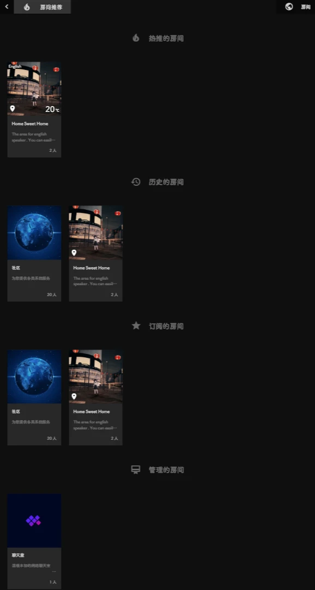
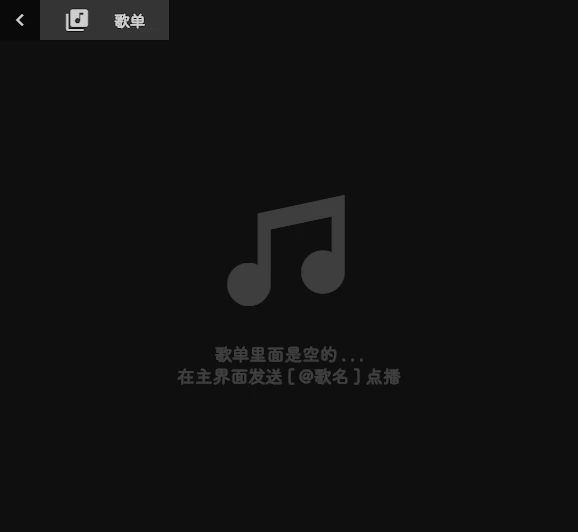
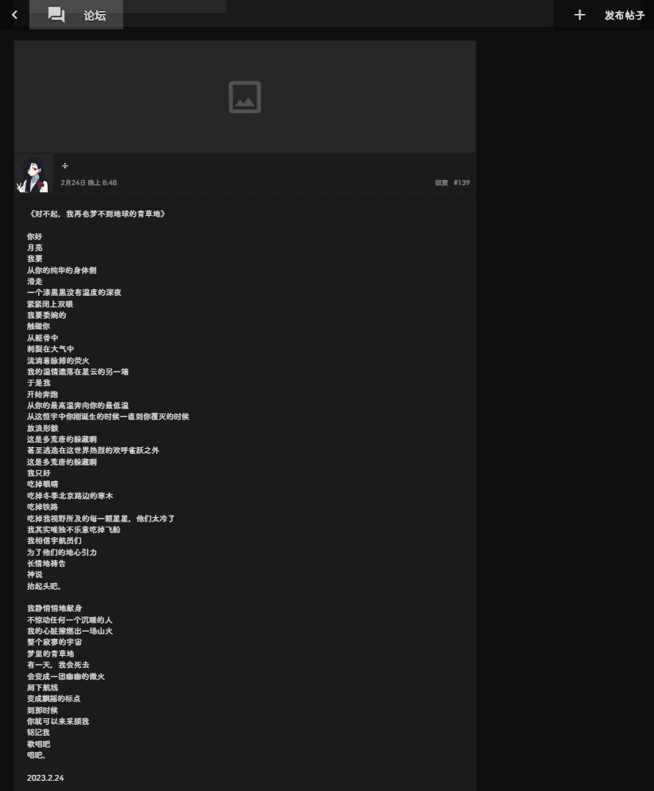
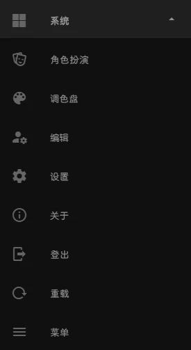
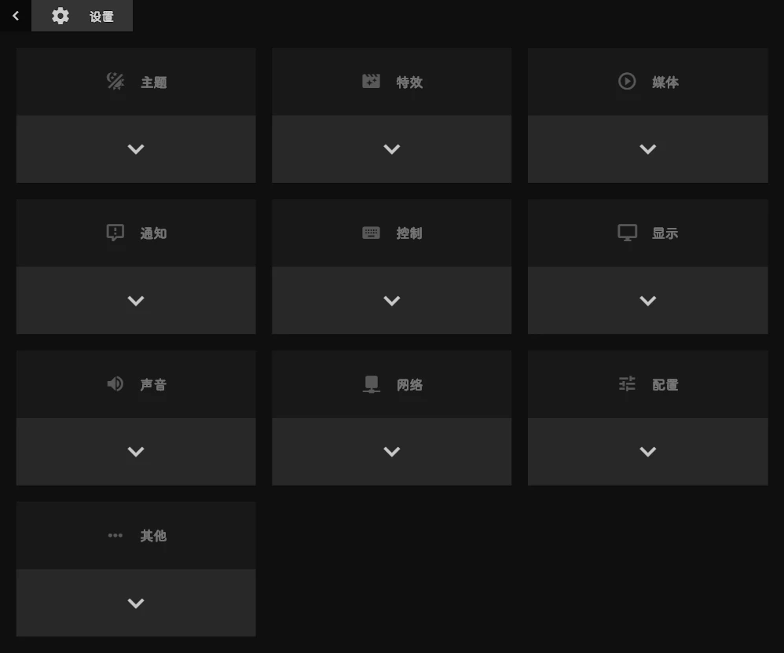
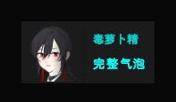
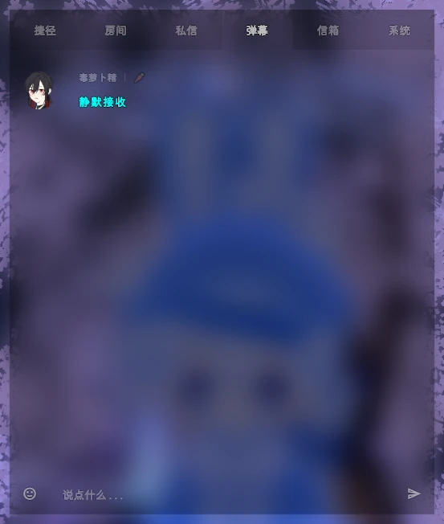

# 蔷薇花园IIROSE：侧边栏详解

> 作者：幽萝Yuro  
> 编辑于 2023年03月05日 02:37

侧边栏是蔷薇的功能和设置的集合，它位于房间界面的左侧，在蔷薇你总会接触到它，下面就让我来详细介绍一下吧~

## 如何开启侧边栏

- **手机端**：按住并 **向右滑动**。
- **电脑端**：在光标不在输入框时按 **回车(Enter)** 键。

  

侧边栏详情图

侧边栏总共有11个分类，下面将从上至下逐一介绍。

## 封面

  

封面预览

封面图可在编辑资料卡时设置标签背景图来修改。下方是自己的头像和昵称，点击后可进入自己的资料卡。

## 一、导航

导航分类的功能大致为：换房、编辑资料、获取帮助。

  

导航分类

### 房间

在 **导航 > 房间** 栏右侧会显示当前所在房间，点击后会弹出房间菜单。

  

房间菜单详情

### 房间推荐

房间推荐按照从上到下顺序列出 **热推房间、历史房间、订阅房间、管理房间**。

  

房间推荐

### 编辑/注册

打开个人资料卡编辑界面，在这里可以修改自己想展示出的信息。

  

资料编辑界面

### 帮助

帮助界面会有一些简单教学和说明。
- **图文教程**：一些简单的功能介绍。
- **视频教程**：链接了[旧版蔷薇视频教程](https://www.bilibili.com/video/BV1is411Y7as)。
- **文档**：放置了其他语言的教程。
- **规章制度**：里面有 **制度、法律、条款** 栏 (尚不完善)。
- **管理人员**：现任管理员和检察官名单。

### 下载APP

:::tip
如使用APP打开则无此项。
:::

里面有蔷薇花园官方制作的 **安卓客户端、网页应用、微信小程序** 获取方式。IOS端和电脑端正在开发中。

  

APP界面

## 二、板块

板块内多是除聊天界面的信息区。

  

板块分类

### 歌单

打开该房间的歌单界面。除 **音乐分享、视频分享** 属性的房间外均无法打开。

  

歌单界面

### 信箱

信箱里会列出最近收到的 **点赞、转账、系统消息和留言**。

:::warning 注意
游客可开启此界面但注册用户无法给游客留言，且游客不能对注册用户使用留言功能。
:::

  

信箱界面

### 论坛

:::warning 注意
游客无法浏览论坛，未绑定手机号的账户可浏览但不能发帖和回复。
:::

论坛会记录近30天内的用户发帖。一经发布则不可由本人删除。

  

论坛截图演示

### 任务板

:::warning 注意
游客无法浏览任务版，未绑定手机号的账户可浏览但不能发布任务和回复。
:::

任务板会记录近30天内的用户任务。发布任务需要从钱包中扣除相应赏金。

  

任务版演示

### 朋友圈

:::warning 注意
游客无法浏览朋友圈，未绑定手机号的账户可浏览但不能发布帖子。
:::

朋友圈会显示你 **关注** 的用户发布的帖子。帖子会永久保留，但可以由本人删除。

  

朋友圈界面

### 搜索

:::warning 注意
游客无法使用搜索功能。
:::

可用来搜索蔷薇注册用户。

#### 用户名搜索
- 至少输入一个字符。
- 排序方式：完全匹配的在最前，其余按昵称占有先后顺序排序。

#### 唯一标识(UID)搜索
- **介绍**：每个注册用户均有唯一的13位ID，由小写字母和数字组成，永久有效，可避免因改名导致的@失效。
- **游客UID**：游客有临时UID，格式为`[@X12位数字@]`，离线后失效。
- **获取**：进入目标资料卡，点击头像/昵称 -> 唯一标识。
- **搜索格式**：`[@13位ID@]` (带空格)、`@13位ID@` (不带空格) 或直接输入13位ID。

  

唯一标识获取演示

### 排行榜

| 榜单       | 规则                                             |
| :--------- | :----------------------------------------------- |
| **股票榜** | 取股票拥有数量前10名。                           |
| **财富榜** | 取蔷薇货币拥有量前20名。                         |
| **贡献榜** | 取投喂站长金额前50名。                           |
| **皇家榜** | 每半小时评估一次总资产，前三名获得临时皇冠头饰。 |

## 三、消费

该分类下多为使用蔷薇货币消费的功能。

:::warning 注意
游客无法打开除 **活动** 和 **三方** 之外的功能。
:::

  

消费分类

- **商城**：用户开设虚拟店铺的地方，使用蔷薇货币结算。
- **银行**：可存取款和凭信用分贷款。
- **炒股**：使用蔷薇货币进行虚拟炒股。
- **商店**：可购买诸多虚拟内容（饰品、房子等）。
- **活动**：获取蔷薇币的方式之一。
- **三方**：与蔷薇合作的网站，目前暂无。

## 四、工具

  

工具分类

- **便签**：可收纳对话、图片等资源。
- **骰子**：让官方BOT在0-9999中抽取一个随机数。
- **配对**：匹配同样开启该功能的用户，较少人使用。
- **链接**：在链接前加上`\`符号，以文本方式展示链接。
- **艾特**：输入昵称后在输入框生成@代码。
- **符号**：提供各类特殊符号输入。
- **翻译机**：支持简中、繁中、英语、日语互译。
- **浏览器**：内置一个简易浏览器。
- **游戏机**：内置GBA模拟器，可玩预设游戏。
- **终端**：输入指令实现相应功能。

## 五、功能

  

功能分类

### 声音

发送内置的短音效。需要在 **设置 -> 声音** 中打开 **声音消息音量**。

### 状态

自定义当前状态，会在多处显示对应图标。

  

群聊界面中的状态

### 签名

:::warning 注意
游客无法使用此功能。
:::

设置后，签名会显示在用户卡片、资料卡、房间目录等多个地方。

  

用户卡片中的签名

### 弹幕

:::warning 注意
游客无法使用此功能但可以看见弹幕，未绑定手机号的用户不可发送。
:::

发送全站可见的滚动弹幕。

| 项目         | 规则                                          |
| :----------- | :-------------------------------------------- |
| **显示时间** | 基础5秒，根据信用分增加，最高15.5秒。         |
| **可用条数** | 基础8条，根据信用分增加。                     |
| **冷却时间** | 默认2小时，根据信用分缩短，最低5分钟。        |
| **付费延长** | 在弹幕前加`$金额`，每1钞延长0.5秒，10钞起步。 |

### 绘画

提供一个简易画板，可将作品发送到聊天界面。

  

绘画板演示

### 通话

- **语音/视频消息**：录制并发送语音或视频片段。
- **拍照**：使用摄像头拍照并发送。
- **实时语音**：在房间内创建或加入实时语音通话。

:::warning 实时语音注意
- 功能尚不完善，语音质量一般。
- 建议佩戴耳机，否则容易产生回音。
- 遇到问题可尝试重载或更换浏览器/客户端。
:::

  

房间实时语音通话

### 上传

支持上传多种格式的文件，单个文件限制在20M内。
- **支持格式**：`jpg`, `jpeg`, `png`, `gif`, `bmp`, `mp3`, `wav`, `mp4`, `webm`, `mkv`, `avi`, `zip`, `rar`, `7z`, `txt` 等。

## 六、系统

系统分类里多为和设置有关的功能。

  

系统分类详情

### 角色扮演

点击可以打开角色扮演界面，设置后可在特定房间以另一身份发言。

  

角色扮演界面

:::tip 使用场景
该功能在 **社区 > 角色扮演** 房间或房间属性带“角色扮演”的用户自建房中可用。初始目的为演绎故事，但几乎没人使用，或许今后可以做TRPG时使用。
:::

### 调色盘

用于选择聊天气泡颜色。颜色信息储存在本地，不同设备可以设置不同的颜色。

  

调色盘

### 编辑/注册

点击后打开个人资料卡信息设置。

### 设置

点击后打开设置界面，可进行更多详细设置。

  

设置界面

### 关于

- **分享**：把蔷薇花园IIROSE分享出去。
- **相关**：查看蔷薇相关资料。
- **喂食**：给站长打赏。
- **留言**：给站长发送留言。
- **APP**：同 **导航 > 下载APP**。
- **帮助**：同 **导航 > 帮助**。
- **日志**：查看蔷薇历史更新信息。

### 登出

点击后会退出登录，回归蔷薇初始界面。

### 重载

功能同 `Ctrl + R`，可用于修复页面错误、解决媒体播放问题、应用最新设置等。

:::warning 异世界BUG
蔷薇有个随机BUG，当群聊界面突然无人发言时你可能已进入“异世界”。此时你可以发言，但无法收听音乐，状态定格。在别人看来你是离线状态。你需要 **重载** 才能回到“现实世界”。
:::

### 菜单

- **深度重载**：功能同 `Ctrl + Shift + R`，可以深层刷新以应用蔷薇最新更新内容。
- **清除缓存**：清除一部分缓存信息，设置和聊天记录均保留。
- **还原初始设置**：
    :::warning 警告
    此操作会清空此应用的所有数据！包括所有设置和聊天记录。如果程序运行出现故障请尝试此选项。
    :::

## 七、其他

其他分类中多为与媒体和背景相关的操作。

  

其他分类

- **媒体点播**：填入链接点播媒体。
- **媒体音量控制**：拖动滑块或点击喇叭调节音量。
- **媒体加载**：控制媒体是否加载的开关。
- **壁纸加载**：控制房间壁纸是否加载的开关。
- **睡眠模式**：开启后媒体和系统音量将锁定为禁用。
- **影院模式**：视频播放时使用，可将视频置于上方或作为背景。
- **动态壁纸**：配合视频基础背景使用。
- **移动壁纸**：开启后基础背景会缓慢循环移动。
- **系统音量**：调节蔷薇的通知和音效音量。
- **壁纸模糊**：设置房间壁纸的模糊程度。
- **背景亮度**：设置所有背景的亮度。

### 弹幕模式

| 模式             | 描述                                         | 截图                                                                                                                                                              |
| :--------------- | :------------------------------------------- | :---------------------------------------------------------------------------------------------------------------------------------------------------------------- |
| **完整气泡**     | 弹幕显示较大，展示在右上角。                 | 

 |
| **轻量气泡**     | 弹幕以小弹窗展示在右上角。                   | 

 |
| **静默接收**     | 界面不显示弹幕，但在主控面板的弹幕栏会记录。 | 

 |
| **拒收**         | 无法发送弹幕，但主控面板仍可接收。           | -                                                                                                                                                                 |
| **跟随睡眠模式** | 为睡眠模式开启前后分别设置不同的弹幕模式。   | -                                                                                                                                                                 |

### 基础背景

可选择官方预设的图片或视频背景，也支持自定义图片背景。

  

基础背景列表

### 剪贴板解析

- **电脑端**：弹出输入框，可填入链接或文本进行解析。
- **手机端**：自动解析当前剪贴板第一个文本。

### 自定义功能菜单

- **清屏**：功能同 `Alt + V`，隐藏当前聊天信息，重载后恢复。
- **锁屏**：功能同 `Ctrl + L`，隐藏输入框和聊天记录，显示系统通知和消息。
- **隐式传送**：移动到其他房间时不显示目标房足迹，而是显示为离线。

  

锁屏界面预览

## 八、盒子

- **上层**：电台(MHz)，仅自己可收听。
- **下层**：媒体(CD)，显示用户点播的媒体信息。

  

盒子详情

## 九、订阅

点击打开自己所订阅的房间列表。

  

订阅列表

## 十、联系人

点击打开自己所关注的用户列表。
- **在线**：显示状态图标。
- **离线**：条目颜色变暗。
- 点击可打开对方的用户卡片。

  

联系人列表

## 十一、消息

此分类展示当前设备上有过私聊的用户列表。

  

消息分类

- 点击右侧进入私聊界面。
- 点击左侧头像可进行更多操作（查看资料、匿名私聊、@、删除条目）。

  

点击左侧头像后

介绍完毕。累死我了，这几天一直在肝这个，终于写完了~ 我要休息休息，我还有好多其他事情要忙，挖的坑慢慢补咯~

修改日期：23.3.4